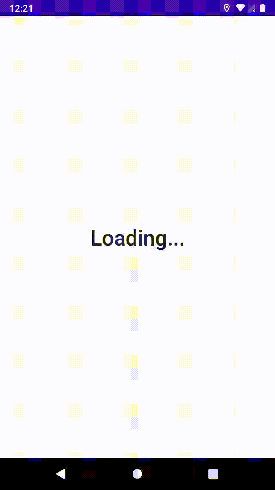

# compose-ssr
Proof of concept of using server side rendering with jetpack compose


Key components:
- SSRService: gateway to the the remote server renderer. For testing purposes this POF comes witha fake SSRService that can be used locally instead. FakeSSRService.
- ComponentComposer: takes the tree of Components resulted from deserializing remote json obtained via SSRService and map them to composable ui functions. For deserialization see ComponentDeserializer.
- Android specifics:
    - SSRActivity: bootstrap the ComponentComposer's composables.
    - SSRViewModel: provides deserialized Components to ComponentComposer as StateFlow. It also provides backstack support.

- Interceptors: These are the main controllers of the application and must be implemented by client. They sit between SSRViewModel and SSRService and can intercept requests and responses. They also are responsible for interaction between the SSRActivity and SSRViewModel, via a Interactor interface. They have the following the interception callbacks:
    - `interceptFromClient` intercepts requests from client to server. must be paired with `acceptFromClient(UriMatching)`
    - `interceptFromServer` intercepts responses from server to client. must be paired with `acceptFromServer(UriMatching)`
    - `onInteract` interaction with SSRViewModel. The provided `ComponentContext` selects components by their id. must be paired `acceptInteractScreen(screenId)`
    - `onCompose` takes control for generating ui composables functions for a screen instead of letting the `ComponentComposer` to the take care of it. must be paired with `acceptComposeScreen(screenId)`.
    For convenience the framework provides a DSL to create Interactors.

- SSRInstaller: setup builder to add interceptors, specify the SSRService implementation and the initial uri entry point for the remote server. The SSRInstaller must be installed in an `Application#onCreate()`


Note: for now the the frawework follows a specific json schema and using Gson.  In the future  clients will be their own deserializers using their favorite json parser.


## Example: clicker

After 3 clicks app ends.
Uses a FakeSSRService with 3 seconds resonse latency.

installing
```kotlin
class MyApp : Application() {

    override fun onCreate() {
        super.onCreate()
        SSRInstaller("https://clicker.net")
            .service(
                FakeSSRService(
                    handlers = listOf(ClickerSSRHandler()),
                    latencyMillisProvider = {3000}
                )
            )
            .interceptors(
                splashScreenInterceptor,
                clickerInterceptor(Gson())
            )
            .install(this)
    }
}
```

fake ssr handler (this the server job in real scenario):
```kotlin
class ClickerSSRHandler : SSRHandler {

    private val matcher = matching("clicker.net", "/", "/count/#")

    companion object {
        private val TEMPLATE: (Int) -> String = { count ->
            """
                {
                    "id" : "count-screen",
                    "type" : "screen",
                    "content": {
                        "id" : "content",
                        "type": "container",
                        "alignment" : {
                            "main-axis" : "center",
                            "cross-axis" : "center"
                        },
                        "children" : [
                         {
                            "id": "count-txt",
                            "type": "text",
                            "text": "$count",
                            "style": {
                                "font-weight" : 600,
                                "font-size": 64
                            }
                        },
              
                            {
                                "id" : "count-btn",
                                "type" : "button",
                                "text" : "Click me!"
                            }
                        ]
                    }
                }
            """.trimIndent()
        }
    }

    override fun accept(uri: Uri): Boolean = matcher.matches(uri)

    override fun handle(uri: Uri, jsonBody: String): Rendered {
        val query = uri.pathSegments.run {
            val countIndex = indexOf("count")
            if (countIndex != -1 && countIndex < lastIndex) {
                this[countIndex + 1].toInt() + 1
            } else {
                0
            }
        }
        return Rendered(Response(uri, TEMPLATE(query)))
    }
}
```

click interceptor.

```kotlin
val clickerInterceptor: (Gson) -> Interceptor = { gson ->

    interceptor {

        val matchClickRequest = matching("clicker.net", "/count/#")

        fromClient(matchClickRequest) {
            sendBackToClientOnSlowRequest {
                val disabledClickBtn = gson.edit(this.request.currentScreen) { json ->
                    val clickBtn = json.obj("content/children[1]")
                    clickBtn["disabled"] = true
                }
                Response(this.request.uri, disabledClickBtn)
            }
        }

        onInteract("count-screen") { interactor, _ ->
            val count = id<Component.Text>("count-txt")?.text?.toInt() ?: 0
            if (count == 3) {
                interactor.debugToast("Hooray you've count to 3. Good bye for now!")
                interactor.closeApp()
            }
            id<Component.Button>("count-btn") {
                onClick = {
                    interactor.request("https://clicker.net/count/$count")
                }
            }
        }

    }
}
```




## Example: Two screens app (login + dashboard).

The login interceptor checks if inputs are not empty sparing for an extra trip to server.

The dashboard interceptor offers pagination.


